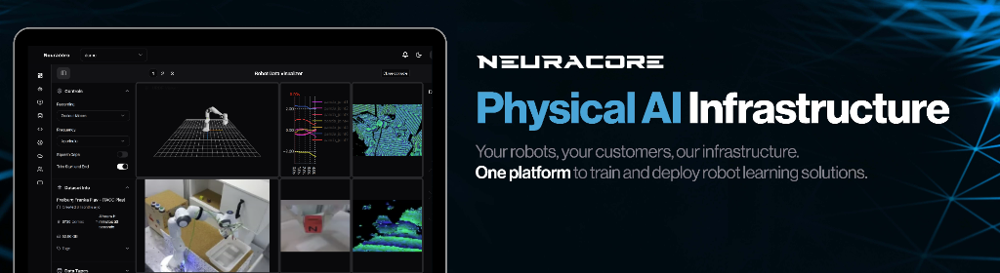

<p>
  <a href="https://www.neuracore.com" target="_blank">
    </a>
</p>

<div align="center">
    <a href="https://pypi.org/project/neuracore/"></a>
    <a href="https://www.python.org/downloads/"></a>
    <a href="https://pepy.tech/project/neuracore"></a>
    <a href="https://github.com/NeuracoreAI/neuracore/commits/main"></a>
    <a href="https://discord.gg/DF5m8V6nbD"></a>
    <a href="https://www.neuracore.com/try-on-colab"></a>
    <a href="https://opensource.org/licenses/MIT"></a>
</div>
<br>

[Neuracore](https://www.neuracore.com/) provides a **unified platform** for the entire lifecycle of Physical and Embodied AI. Built on years of foundational research. Neuracore is **fast**, **accurate**, and **scalable**. Constantly updated for performance and flexibility, our platform excels at high-frequency synchronized data logging, real-time visualization, cloud-native policy training, and low-latency edge deployment.

**Try Neuracore now:** [Sign up for a free account](https://www.neuracore.com/) and start training your robots in minutes. 

Find comprehensive guides in the [Neuracore Docs](https://docs.neuracore.com/), get support via [GitHub Issues](https://github.com/NeuracoreAI/neuracore/issues), and join the conversation on [Discord](https://discord.gg/DF5m8V6nbD).

Request an [Enterprise Support](mailto:licensing@neuracore.com) for tailored solutions and commercial deployment.

<a href="https://www.neuracore.com/platform" target="_blank">
  
</a>

**have a better image that shows data synchronization**


<br>

<div align="center">
  <a href="https://github.com/NeuracoreAI"></a>
  
  <a href="https://linkedin.com/company/neuracoreai/"></a>
  
  <a href="https://x.com/Neuracore_AI"></a>
  
  <a href="https://www.youtube.com/@neuracoreai"></a>
  
  <a href="https://discord.gg/DF5m8V6nbD"></a>
</div>

## ✨ Key Features

- **Collect** - High-frequency streaming data logging with support for fully custom multi-modal data types.
- **Visualize** - Real-time dataset visualization, playback, and precise synchronization via a unified dashboard.
- **Train** - Frictionless deployment of state-of-the-art robot learning algorithms on scalable cloud GPU infrastructure.
- **Deploy** - Seamless policy inference and low-latency execution engines built directly for production environments.

<br>


## 📄 Documentation

See below for quickstart installation and usage examples. For comprehensive guidance, refer to our full [Neuracore Docs](https://docs.neuracore.com/), or jump straight to a specific topic:


<br>

<details open>
<summary><b>Install</b></summary>

Install the `neuracore` package including all requirements in a [**Python>=3.10**](https://www.python.org/) environment.

[](https://pypi.org/project/neuracore/) [](https://pepy.tech/project/neuracore) [](https://pypi.org/project/neuracore/)

> **Note:** Installing the `ffmpeg` binary is recommended for faster video encoding during recording and decoding during playback/import. If unavailable, Neuracore falls back to PyAV automatically.
>
> **Linux (Debian/Ubuntu):** `sudo apt-get update && sudo apt-get install -y ffmpeg`

```bash
# Basic installation for data logging and visualization
pip install neuracore

# For training and ML development
pip install neuracore[ml]

# For bulk importing datasets 
pip install neuracore[import]

# To run our example scripts
pip install neuracore[examples]
```

For alternative environments consult the [Neuracore Quickstart Guide](https://docs.neuracore.com/quickstart/).

</details>

<details>
<summary><b>Usage</b></summary>

### Python

Collect multi-modal data and deploy trained policies in minutes.

```python
import neuracore as nc

# Authenticate and register your robot
nc.login()
nc.connect_robot(robot_name="MyRobot", urdf_path="/path/to/robot.urdf")

# Stream and log high-frequency sensor data
nc.start_recording()
nc.log_joint_positions(positions={'j1': 0.1, 'j2': -0.3})
nc.log_rgb(name="wrist_cam", rgb=image_array)
nc.log_depth(name="wrist_cam", depth=depth_array)
nc.stop_recording()

# Deploy a trained policy for real-time inference
policy = nc.policy(train_run_name="MyTrainingJob")
action = policy.predict()
```

### CLI

The Neuracore CLI allows you to manage datasets, hardware, and cloud training directly from your terminal. This is the fastest way to verify your system and trigger cloud-based AI jobs.

```bash
# 1. Launch the background data pipeline (required for all streaming tasks)
nc-data-daemon launch

# 2. Connect a robot via URDF and create a new dataset
neuracore connect --name "MyRobot" --urdf "/path/to/robot.urdf"
neuracore datasets create --name "My Robot Dataset"

# 3. Start/Stop recording data streams
neuracore record start
neuracore record stop

# 4. Kick off a Diffusion Policy training run on 5 cloud GPUs
neuracore train start --name "MyJob" --dataset "My Robot Dataset" --algo "diffusion_policy" --gpus 5

# 5. Run a trained model on a live camera source
neuracore predict --model "MyJob" --source "top_camera"
```

</details>


<details>
<summary><b>🍰 A Short Taste</b></summary>

Here is a brief glimpse into what Neuracore can do. For a detailed walk-through, please refer to our tutorials and comprehensive documentation.

```python
import neuracore as nc # pip install neuracore
import time

# Ensure you have an account at neuracore.com
nc.login()

# Connect to a robot with URDF
nc.connect_robot(
    robot_name="MyRobot", 
    urdf_path="/path/to/robot.urdf",
)

# Create a dataset for recording
nc.create_dataset(
    name="My Robot Dataset",
    description="Example dataset with multiple data types"
)

# Recording and streaming data
nc.start_recording()
t = time.time()
nc.log_joint_positions(positions={'joint1': 0.5, 'joint2': -0.3}, timestamp=t)
nc.log_rgb(name="top_camera", rgb=image_array, timestamp=t)

# Stop recording, the dataset is automatically uploaded to the cloud
nc.stop_recording()

# Kick off cloud training
job_data = nc.start_training_run(
    name="MyTrainingJob",
    dataset_name="My Robot Dataset",
    algorithm_name="diffusion_policy",
    num_gpus=5,
    frequency=50,
)

# Load a trained model locally
policy = nc.policy(
    train_run_name="MyTrainingJob",
)

# Get model inputs
nc.log_joint_positions(positions={'joint1': 0.5, 'joint2': -0.3})
nc.log_rgb(name="top_camera", rgb=image_array)

# Model Inference
predictions = policy.predict(timeout=5)
```

</details>

| Quick Links | Description |
| :-- | :-- |
| 🚀 **[Tutorials](https://docs.neuracore.com/tutorials/)** & **[Examples](https://docs.neuracore.com/examples/)** | Step-by-step guides for teleoperation and end-to-end setups. |
| ☁️ **[Training](https://docs.neuracore.com/training/)** | How to kick off cloud training runs and evaluate policies. |
| 💻 **[Command Line Tools](https://docs.neuracore.com/cli/)** | Full command reference for the `neuracore` CLI. |
| ⚙️ **[Data Daemon](https://docs.neuracore.com/daemon/)** | Managing the background data streaming pipeline. |
| 📥 **[Dataset Importer](https://docs.neuracore.com/importer/)** | Formatting custom datasets and migrating from external sources. |
| 🔒 **[Environment Variables](https://docs.neuracore.com/env/)** | Securely configuring your Neuracore runtime context. |
| 🤝 **[Contribution Guide](https://docs.neuracore.com/contribute/)** | Guidelines to help you contribute back to the open source project. |


## 💻 Supported Models

Neuracore supports state-of-the-art robot learning algorithms out of the box, optimized for throughput and stability. You can also **[upload your own custom algorithms](https://docs.neuracore.com/custom-models/)**  Our Platform provides a flexible plugin interface to collect, train, evaluate, and deploy any policy architecture on our cloud infrastructure.


** Some sort of image that shows model performance**


| Algorithm | Architecture | Cloud Training | Inference Speed (ms) | Status |
| :--- | :--- | :---: | :---: | :---: |
| **CNN-MLP** | Behavioural Cloning | ✅ | 5-10 | Production |
| **Diffusion Policy** | Energy-Based Diffusion | ✅ | 15-30 | Production |
| **ACT** | Action Chunking Transformer | ✅ | 20-40 | Production |
| **pi0** | Flow Matching (VLA) | ✅ | 25-50 | Beta |
| **Custom Model** | Bring Your Own | ✅ | N/A | [Upload Yours →](https://docs.neuracore.com/custom-models/) |

<br>

## 🧩 Integrations

Neuracore integrates seamlessly with leading robotics simulators and machine learning platforms.

<br>

| Simulators | Frameworks | ML Platforms |
| :---: | :---: | :---: |
| Mujoco, PyBullet, Isaac Gym | ROS1/ROS2, LeRobot, Bigym | Hugging Face, W&B, CometML |

# 📑 Citation

If Neuracore accelerates your robotics research or product development, we kindly ask that you cite our platform:

```bibtex
@software{Neuracore,
  author = {Neuracore Team},
  title = {Neuracore},
  month = {January},
  year = {2026},
  url = {https://github.com/NeuracoreAI/neuracore}
}
```

<br>

## 📜 License

Neuracore is available under the **[MIT License](https://github.com/NeuracoreAI/neuracore/blob/main/LICENSE)**.

See the [`LICENSE.md`](https://github.com/NeuracoreAI/neuracore/blob/main/LICENSE) file for the complete terms and conditions regarding distribution, modification, and commercial use.

<br>

## 📞 Contact

For bug reports and feature requests related to Neuracore software, please visit [GitHub Issues](https://github.com/NeuracoreAI/neuracore/issues). For questions, discussions, and community support, join our active community on [Discord](https://discord.gg/DF5m8V6nbD). We're here to help with all things Neuracore!

<br>

<div align="center">
  <a href="https://github.com/NeuracoreAI"></a>
  
  <a href="https://linkedin.com/company/neuracoreai/"></a>
  
  <a href="https://x.com/Neuracore_AI"></a>
  
  <a href="https://www.youtube.com/@neuracoreai"></a>
  
  <a href="https://discord.gg/DF5m8V6nbD"></a>
</div>
